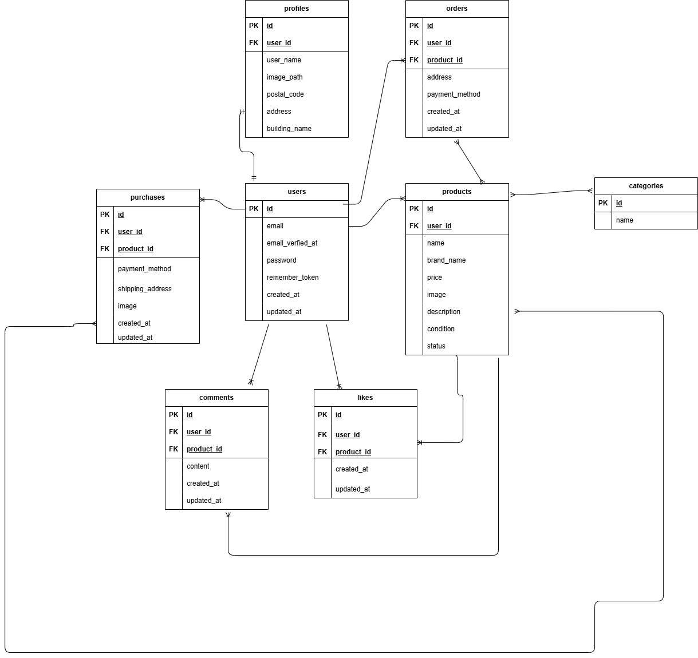

# 模擬案件フリマアプリ
---
## 環境構築
---
- Dockerビルド
1. 
2. DockerDesktopアプリを立ち上げる
3. docker-compose up -d --build

- Laravel環境構築
1. docker-compose exec php bash
2. composer install
3. 「.env.example」ファイルを「.env」ファイルに命名を変更。または、新しく.envファイルを作成
4. .envに以下の環境変数を追加
```
DB_HOST=myspl
DB_DATABASE=laravel_db
DB_USERNAME=laravel_user
DB_PASSWORD=laravel_pass
```
6. php artisan key:generate
7. php artisan migrate
8. php artisan db:seed

## ER図


## テストアカウント
---
name: テスト
email: tesuto@gmail.com
password: password
